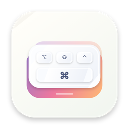
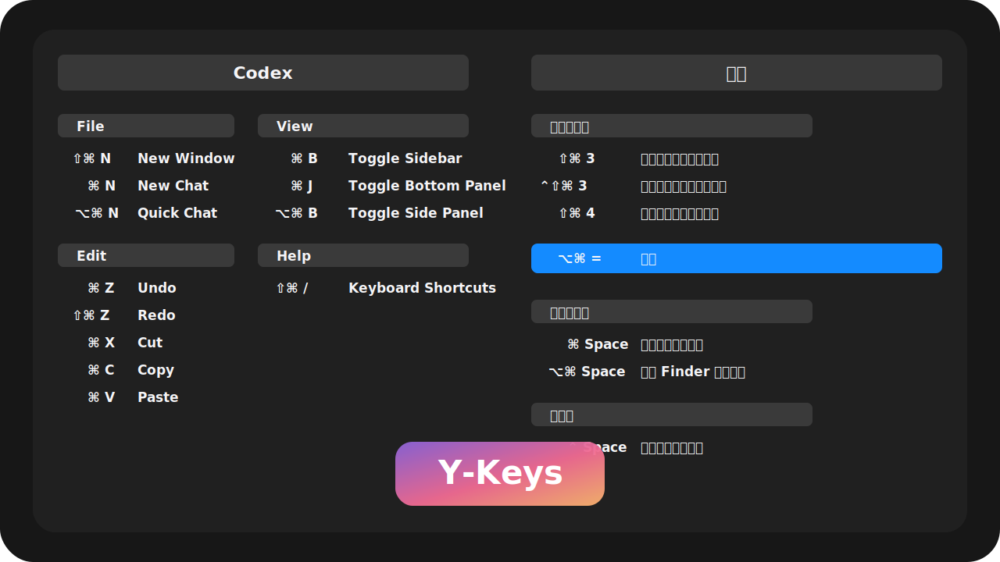

<div align="center">



# Y-Keys

**快速双击左 Command，立刻看到当前 App 和系统可用快捷键。**

一个轻量、常驻菜单栏的 macOS 快捷键速查工具。它会在你当前工作的 App 上方显示一层深色快捷键面板；按住 `⌘`、`⌥`、`⌃`、`⇧` 等按键时，修饰键完全兼容的快捷键及其名称会实时高亮。


[](https://github.com/Rainchen537/Y-Keys/releases/latest)



</div>

## 功能

| 功能 | 体验 |
| --- | --- |
| 左 Command 双击呼出 | 快速连按两次左侧 `⌘`，在当前屏幕中央显示快捷键面板。 |
| 当前 App 快捷键 | 跟踪最近激活的外部 App，并通过 Accessibility API 读取其菜单栏快捷键；设置窗口置前时也不会误扫 Y-Keys 自身。 |
| 系统快捷键 | 内置常用系统快捷键，覆盖聚焦、截屏、辅助功能、输入法和程序坞。 |
| 单屏完整展示 | 面板会按可用屏幕空间自动拆成多列并缩放，为应用和系统分组锁定计算后的宽度；应用快捷键再多也不会把右侧系统快捷键挤出屏幕。 |
| 精确实时高亮 | 按住 `⌘` 时高亮所有包含 `⌘` 的候选项及其名称；继续按 `⇧` 后，不含 `⇧` 的组合会立即变暗，只保留修饰键完全兼容的候选项。 |
| Esc 安全退出 | 没有 Esc 快捷键时按一次退出；存在 Esc 快捷键时第一次显示“再次按下 Esc 退出”，在 1.2 秒内再按一次退出，两次 Esc 都会被 Y-Keys 拦截而不会传给原 App。 |
| 轻量关闭规则 | 点击快捷键行会保持面板；点击背景、面板外区域或按下不属于任何快捷键组合的键会关闭面板。 |
| 统一设置窗口 | 菜单栏入口打开独立设置窗口，可查看触发方式、权限状态、版本，并手动检查 GitHub Release 更新。 |
| 权限分项诊断 | 辅助功能、输入监控和键盘监听运行状态分别显示；从系统设置返回 App 时会重新检测权限并重试监听，权限状态推进时会继续提示下一项而不重复轰炸相同警告。 |
| 正式安装版切换 | 权限页区分正式安装版与开发副本，并可切换到签名验证通过的 `/Applications/Y-Keys.app`。 |
| 原生菜单栏工具 | 默认不显示 Dock 图标，不打断当前工作流。 |

## 安装

下载安装包：

1. 前往 [Releases](https://github.com/Rainchen537/Y-Keys/releases/latest) 下载最新 [`Y-Keys-v0.1.4.dmg`](https://github.com/Rainchen537/Y-Keys/releases/download/v0.1.4/Y-Keys-v0.1.4.dmg)。
2. 打开 DMG。
3. 将 `Y-Keys.app` 拖到 `Applications`。
4. 启动后按提示开启辅助功能与输入监控权限。

## 从源码构建

需要 macOS 13+ 和 Xcode Command Line Tools。当前仓库默认面向 Apple Silicon 构建。

```zsh
git clone https://github.com/Rainchen537/Y-Keys.git
cd Y-Keys
./icon/make_icns.sh
./build.sh
./make_dmg.sh
./install_app.sh
```

构建产物位于：

```text
build/Y-Keys.app
dist/Y-Keys.dmg
```

## 权限说明

Y-Keys 会分别检测 **Accessibility / 辅助功能** 与 **Input Monitoring / 输入监控**：

| 权限 | 用途 |
| --- | --- |
| Accessibility | 读取当前 App 菜单快捷键，并为全局事件监听提供辅助功能授权。 |
| Input Monitoring | 监听左 Command 双击和按键状态，用于呼出面板与实时高亮。 |

授权路径：

```text
System Settings
→ Privacy & Security
→ Accessibility
→ 勾选 Y-Keys

System Settings
→ Privacy & Security
→ Input Monitoring
→ 勾选 Y-Keys
```

- 权限页会分别显示两项权限的状态，并提供独立的请求与系统设置入口。
- 首次启动会汇总仍需完成的权限；后续从系统设置返回 Y-Keys 时会重新检测并按顺序提示当前第一项未完成步骤，完全相同的运行副本与权限状态不会重复弹窗。
- 若键盘监听尚未运行，App 会自动重试启动；两项 TCC 权限已开启但当前进程仍无法监听时，会提示重启正式安装版。
- 权限页也会验证当前副本是否为 `/Applications/Y-Keys.app` 中 Bundle ID 与 Developer ID 团队签名均匹配的正式安装版；开发副本可直接切换到验证通过的安装版。
- 如果系统设置里显示已授权但 App 仍无法监听，可点击 **「刷新记录」**，或运行 `./reset_accessibility.sh`。两种方式都只会重置 Y-Keys 自身 Bundle ID 的 Accessibility 与 Input Monitoring TCC 记录，并在重新授权后从 `/Applications` 启动正式安装版。

## 技术实现

```text
Swift
AppKit
Accessibility API / AXUIElement
CoreGraphics CGEventTap
NSPanel / NSVisualEffectView / NSStatusItem
```

当前版本优先读取当前 App 的菜单栏快捷键；系统快捷键先以内置清单维护，后续可以继续扩展到读取 `com.apple.symbolichotkeys` 并映射用户自定义项。

## 与 Y 系列的统一性

Y-Keys 延续了 Y-Clip 和 Y-Dock 的产品方向：

- 菜单栏常驻，不占 Dock。
- 原生 Swift + AppKit，无第三方依赖。
- 深色毛玻璃浮层、克制圆角、蓝色强调态。
- App 图标以修饰键组、宽 `Command` 键和错位键盘层表达“快捷键面板 + 双击触发”；浅色 macOS 底板、深靛蓝符号与粉紫到橙色渐变延续 Y-Clip / Y-Dock 的视觉家族。
- 菜单栏使用透明模板线稿，以双层错位键帽和 `Command` 符号保持小尺寸辨识度，并自动适配系统浅色/深色菜单栏。

## 许可

MIT License
